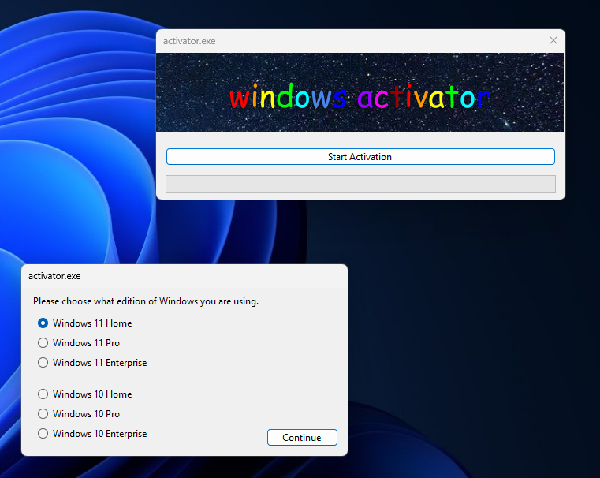

# activator
> [!warning]
> For some reason, my commits are being signed by [b3nk3nobi](https://github.com/b3nk3nobi). No idea who they are, but my git credientals are and always will be "Ben Daws" and "ben@linuxfornoobs.org".

A basic visual wrapper over the Windows 10 and Windows 11 kms activation servers hosted by [msguides](https://msguides.com).
It is pretty easy to use, you just select "start activation" and select what edition of Windows you are using. 

It is built in .NET 8 but my releases are self-contained executables that bundle the .net runtime in them.

## Support
It supports these versions:

- Windows 11
  - Windows 11 Home
  - Windows 11 Pro
  - Windows 11 Enterprise
- Windows 10
  - Windows 10 Home
  - Windows 10 Pro
  - Windows 10 Enterprise
